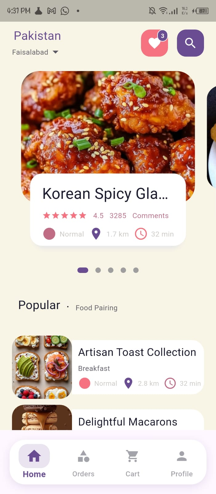
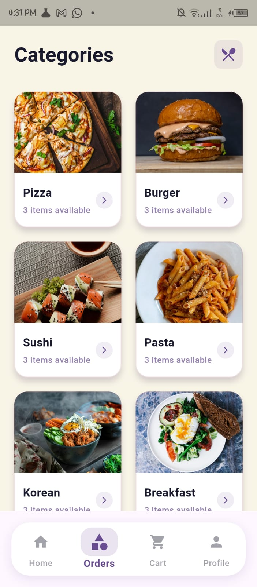
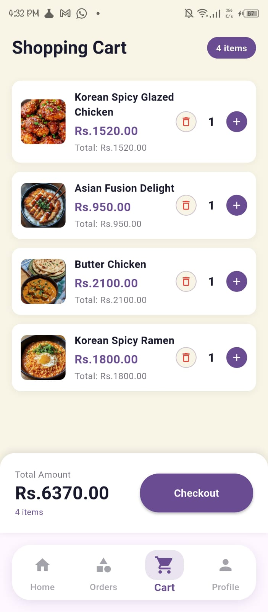
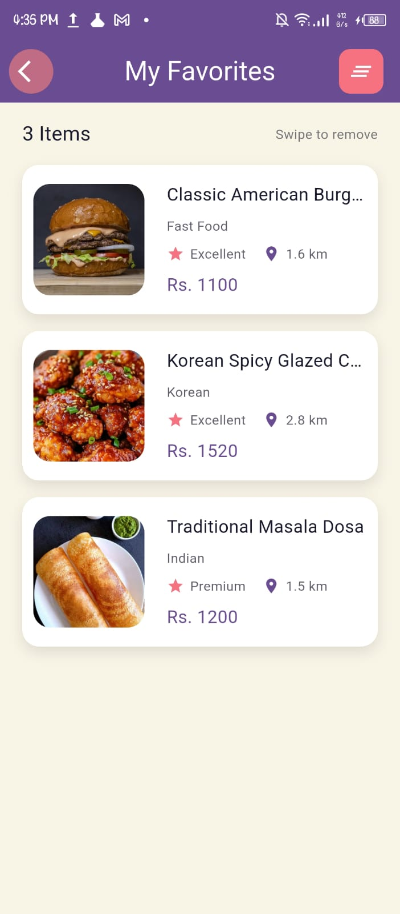
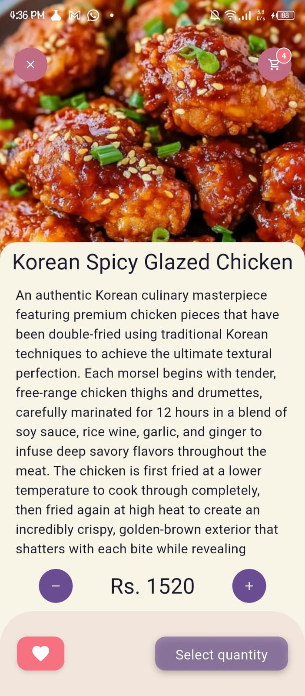
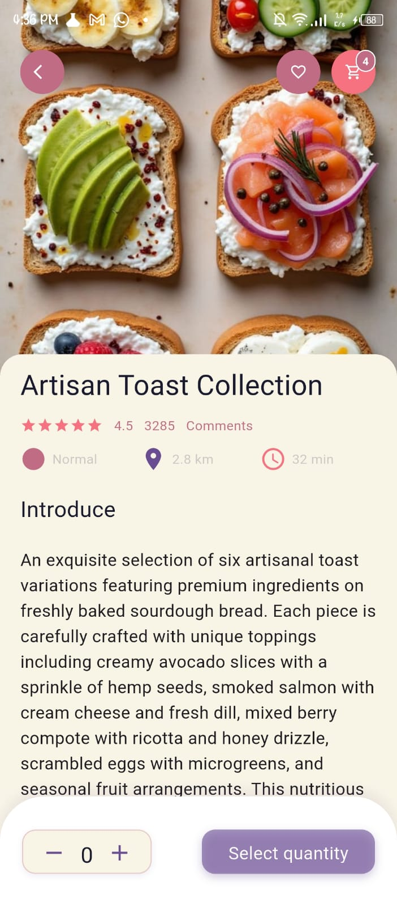

# 🍔 Food App

A fully functional and professionally designed **Food Ordering App** built with Flutter. The application provides a complete food-ordering experience, including user authentication, food discovery, categories, favorites, cart management, order navigation, and profile management.

The app focuses on a clean and modern UI while providing a smooth and intuitive experience for browsing food items and managing orders.

---

## ✨ Features

### 🔐 Authentication

* User Sign Up
* User Login
* Secure authentication flow
* Logout functionality

### 🏠 Home

* Professional and modern home page
* Sliding food/category menu
* Horizontally scrollable food sections
* Food items displayed using ListView
* Attractive food cards
* Food details with descriptions
* Easy navigation to individual food items

### 📋 Orders

* Dedicated Orders section
* Bottom navigation bar
* Multiple food categories
* Browse and explore different types of food
* Organized food listing

### ❤️ Favorites

* Add food items to favorites
* Dedicated Favorites page
* Easily access saved food items

### 🛒 Cart

* Add food items to cart
* View selected items
* Manage cart items
* Dedicated Cart page
* Easy navigation between food selection and cart

### 👤 Profile

* User profile section
* Profile image
* Account information
* Logout functionality

---

## 📱 Screenshots

### 🏠 Home Page

The home page provides a professional food-discovery experience with a sliding food menu, categorized sections, and scrollable food listings.



---

### 📋 Orders Page

The Orders section provides easy access to multiple food categories through the bottom navigation and organized food listings.



---

### 🛒 Cart Page

The Cart page displays the food items selected by the user and provides a convenient way to manage the current order.



---

### 👤 Profile Page

The Profile page includes the user's profile image, account information, and logout functionality.


---

### ❤️ Favorites Page

Users can save their favorite food items and access them from the dedicated Favorites section.



---

### 🍕 Food Details

Users can open individual food items to view their image, name, description, and other relevant details before adding them to their cart or favorites.





---

## 🛠️ Tech Stack

* **Flutter**
* **Dart**
* **Firebase**
* **Firebase Authentication**
* **Firebase Realtime Database**
* **Firebase Storage**
* **GetX**
* **ListView**
* **Bottom Navigation**
* **Material Design**

---

## 📂 Project Structure

```text
lib/
├── constants/
├── controllers/
├── models/
├── screens/
├── services/
├── widgets/
└── main.dart
```

---

## 🚀 Getting Started

### 1. Clone the repository

```bash
git clone https://github.com/zainabk4/flutter_food_app.git
```

### 2. Navigate to the project

```bash
cd flutter_food_app
```

### 3. Install dependencies

```bash
flutter pub get
```

### 4. Run the application

```bash
flutter run
```

---

## 🎯 Project Highlights

* Complete user authentication flow
* Modern and professional UI
* Firebase integration
* Food categories and browsing
* Favorites management
* Cart functionality
* Profile management
* Responsive Flutter UI
* Clean navigation using bottom navigation
* Interactive food details

---

## 👩‍💻 Developer

**Zainab K**

Built with ❤️ using Flutter.
